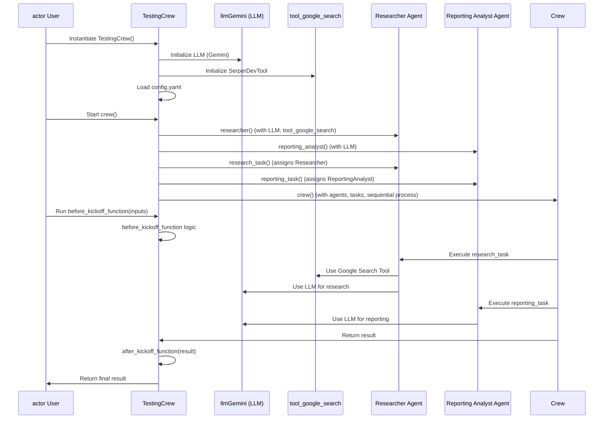
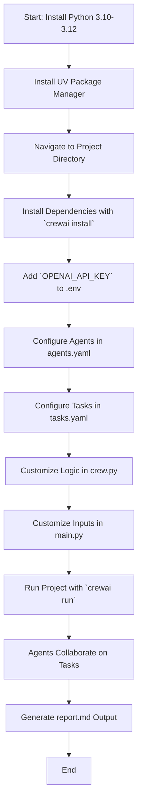

# Brand Monitoring Crew

Welcome to the Brand Monitoring Crew project, powered by [crewAI](https://crewai.com). This project is designed to create brand summaries using agents, leveraging the powerful and flexible framework provided by crewAI. Our goal is to enable your agents to collaborate effectively on generating comprehensive brand summaries, maximizing their collective intelligence and capabilities.


## How the agents Works:



## Installation

Ensure you have Python >=3.10 <3.13 installed on your system. This project uses [UV](https://docs.astral.sh/uv/) for dependency management and package handling, offering a seamless setup and execution experience.

First, if you haven't already, install uv:

```bash
pip install uv
```

Next, navigate to your project directory and install the dependencies:

(Optional) Lock the dependencies and install them by using the CLI command:
```bash
crewai install
```
### Customizing

**Add your `OPENAI_API_KEY` into the `.env` file**

- Modify `src/testing_crew/config/agents.yaml` to define your agents
- Modify `src/testing_crew/config/tasks.yaml` to define your tasks
- Modify `src/testing_crew/crew.py` to add your own logic, tools and specific args
- Modify `src/testing_crew/main.py` to add custom inputs for your agents and tasks

## Running the Project

To kickstart your crew of AI agents and begin task execution, run this from the root folder of your project:

```bash
$ crewai run
```

This command initializes the testing_crew Crew, assembling the agents and assigning them tasks as defined in your configuration.

This example, unmodified, will run the create a `report.md` file with the output of a research on LLMs in the root folder.

## Understanding Your Crew

The testing_crew Crew is composed of multiple AI agents, each with unique roles, goals, and tools. These agents collaborate on a series of tasks, defined in `config/tasks.yaml`, leveraging their collective skills to achieve complex objectives. The `config/agents.yaml` file outlines the capabilities and configurations of each agent in your crew.


## Class Diagram
```
classDiagram
    class TestingCrew {
        - llmGemini: LLM
        - agents_config: Dict[str, dict]
        - tasks_config: Dict[str, dict]
        - agents: List[BaseAgent]
        - tasks: List[Task]
        - company_name: str
        - tool_google_search: SerperDevTool
        + before_kickoff_function(inputs)
        + researcher() Agent
        + reporting_analyst() Agent
        + research_task() Task
        + reporting_task() Task
        + crew() Crew
        + after_kickoff_function(result)
    }

    class LLM {
        + model: str
        + temperature: float
    }

    class Agent {
        + config: dict
        + verbose: bool
        + llm: LLM
        + tools: List[BaseTool]
        + function_calling_llm: LLM
    }

    class Task {
        + config: dict
        + agent: Agent
        + output_file: str
    }

    class Crew {
        + agents: List[Agent]
        + tasks: List[Task]
        + process: Process
        + verbose: bool
    }

    class SerperDevTool {
        + name: str
        + n_results: int
    }

    class BaseAgent {}
    class BaseTool {}
    class Process {}

    TestingCrew --> LLM : uses
    TestingCrew --> SerperDevTool : uses
    TestingCrew --> Agent : creates
    TestingCrew --> Task : creates
    TestingCrew --> Crew : creates
    Agent --> LLM : uses
    Agent --> BaseTool : uses
    Task --> Agent : assigned to
    Crew --> Agent : has
    Crew --> Task : has
```

## Step to replicate the workflow:
